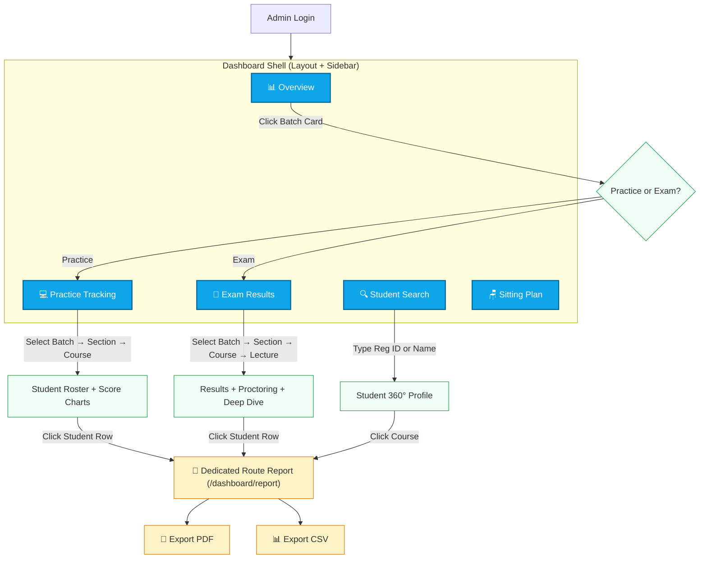

# 🏛️ Admin/Teacher Portal — Complete Redesign Plan

> Based on a thorough analysis of all 18 `_v2` tables, 7 existing SQL views, and actual sample data from your Supabase DB.
> **Note:** We are building this as a completely new Next.js project inside `new-admin-portal-good-flow`, abandoning the old frontend codebase but keeping this robust architecture.

---

## 🎨 Step 0: UI & Design System
*We are strictly porting the design language from `AdminPortal` without porting its complex data-fetching flows.*

- **Theme Base:** The portal will load in **Light Mode** by default (`bg-slate-50` / `bg-white`).
- **Icons & Emojis:** We will use `lucide-react` icons and the precise emoji pairings from the older portal to maintain the familiar aesthetic.
- **Components to reuse:** 
  - Glassmorphism (`.glass-panel`, `.glass-card`)
  - Elevated cards (`.card`, `rounded-xl`, `shadow-sm`)
  - Buttons (`.btn-primary`, `.btn-secondary`, `.btn-danger`)
  - Sleek tables (`.table-wrapper`, `.badge`)
  - SVGs (`CircularProgress.js` for donut charts with gradient strokes)
- **Auth System:** We will **NOT** use a mock auth bypass. We will integrate the real Authentication system which already has separate logins for Admins and Teachers, ensuring security and proper role-based routing from day one.

---

## 🗺️ Portal Architecture — One Path, No Duplication



---

## 📄 Pages & What They Show

### Page 1: `📊 Overview` (`/dashboard`)
**Purpose:** Executive command center. High-level numbers ONLY. No drill-down, no student tables.

| Widget | Data Source | What It Shows |
|--------|-----------|---------------|
| Total Students | `students_v2` COUNT | Number across all batches |
| Total Batches | `batches_v2` COUNT | Active batches |
| Total Courses | `batch_courses_v2` COUNT DISTINCT | Assigned courses |
| Total Teachers | `teachers_details_v2` COUNT | Faculty members in the university |
| Active Today | `results_v2` WHERE submitted_at = today | Students who submitted today |
| Avg Performance | `results_v2` AVG(marks/total) | University-wide average |
| **Batch Cards** | `view_batch_overview` + `teachers_details_v2` | Grid of cards: name, dates, student count, course count, avg performance bar, **assigned instructor** |

**Actions:**
- Clicking a Batch Card → popup asking "View Practice Analytics" or "View Exam Analytics" → routes to the respective tab with `batchId` pre-filled via URL param.

**Exports:** None (it's just a summary).

**SQL View:** `view_batch_overview` ✅ (already exists, no changes needed)

---

### Page 2: `💻 Practice Tracking` (`/dashboard/practice`)
**Purpose:** Monitor non-proctored, continuous learning (courses where `course_type = 'practice'`).

**Filters (inline dropdowns, NO routing):**
| # | Filter | Source | Required? |
|---|--------|--------|-----------|
| 1 | Batch | `useDashboard().batches` (cached) | ✅ Yes |
| 2 | Section | `selectedBatch.sections` (cached) | ❌ Optional ("All" default) |
| 3 | Course | `selectedBatch.courses.filter(c => c.course_type === 'practice')` | ✅ Yes |

**Data Shown After Selection:**

| Component | Data Source (View) | Details |
|-----------|-------------------|---------|
| **Summary Cards** | `view_student_course_completion` | Avg Course Score %, Completed count, At Risk count, Not Started count |
| **Score Distribution Bar Chart** | `view_course_score_distribution` | 90-100%, 75-89%, 50-74%, Below 50%, Not Started brackets |
| **Student Roster Table** | `view_student_course_completion` + `resumes_v2` | Reg ID, Name, Section, MCQ Marks, Coding Marks, Course Score %, Status badge, Last Activity. **Lecture Progress**: shows completed vs resumed for current subunit |
| **Lecture Completion Line Chart** | `view_lecture_completion_stats` | Per-lecture avg coding + MCQ scores, submission counts |

**Actions:**
- Click any student row → opens the **Shareable Deep Dive Report** for the specific course selected in the dropdown.

**Exports:**
- 📊 **CSV** of the Student Roster Table
- 📄 **PDF** of the Student Roster Table (entire section screenshot via html2pdf)

**SQL Views:** `view_student_course_completion` ✅, `view_course_score_distribution` ✅, `view_lecture_completion_stats` ✅

---

### Page 3: `📝 Exam Results` (`/dashboard/results`)
**Purpose:** Deep exam analytics with proctoring data, behavioral tracking, and student deep dives.

**Filters (inline dropdowns, NO routing):**
| # | Filter | Source | Required? |
|---|--------|--------|-----------|
| 1 | Batch | `useDashboard().batches` (cached) | ✅ Yes |
| 2 | Section | `selectedBatch.sections` (cached) | ❌ Optional |
| 3 | Course | `selectedBatch.courses.filter(c => c.course_type === 'exam')` | ✅ Yes |
| 4 | Lecture | Fetched from `view_lecture_completion_stats` for selected course | ❌ Optional (drill deeper) |

**Data Shown After Selection:**

| Component | Data Source | Details |
|-----------|-----------|---------|
| **Exam Config Card** | `lecture_exam_config_v2` | When a lecture is selected: Time limits, shuffle settings, proctoring strictness |
| **MCQ Summary Card** | `view_section_student_scores` aggregated | Pass/Fail count, Avg MCQ Score % |
| **Coding Summary Card** | `view_section_student_scores` aggregated | Pass/Fail count, Avg Coding Score % |
| **Proctoring Summary Card** | `view_exam_proctoring_summary` aggregated | Avg Focus Lost, Avg Tab Switches, Avg Disconnects |
| **MCQ Pass/Fail Pie Chart** | Computed from student scores | Donut chart |
| **Coding Pass/Fail Pie Chart** | Computed from student scores | Donut chart |
| **Avg Scores Bar Chart** | Computed from student scores | MCQ vs Coding side-by-side |
| **Proctoring Bar Chart** | `view_exam_proctoring_summary` | Focus/Tabs/Disconnects grouped bar |
| **Student Results Table** | `view_section_student_scores` + `view_exam_proctoring_summary` + `student_exam_attempts_v2` | Reg ID, Name, Section, MCQ marks, Coding marks, **Allowed Attempts (e.g. 2/1)**, Submit Reason, Compile Count, Submit Count, Focus/Tabs/Disconnects |

**Actions:**
- Click any student row → opens the **Shareable Deep Dive Report**

**Exports:**
- 📊 **CSV** of the Student Results Table (all columns)
- 📄 **PDF** of Summary Cards + Charts + Table

**SQL Views:** `view_section_student_scores` ✅, `view_exam_proctoring_summary` ✅, `view_lecture_completion_stats` ✅

---

### Page 4: `🔍 Student Search` (`/dashboard/search`)
**Purpose:** Quick lookup of any student by Reg ID or Name, then see their full 360° profile.

**Search Input:** Type-ahead search across `students_v2.uni_reg_id` and `students_v2.student_name`.

**Data Shown After Selecting a Student:**

| Component | Data Source | Details |
|-----------|-----------|---------|
| **Student Info Card** | `students_v2` | Name, Reg ID, Section, Batch, Email, Phone, Profile Image |
| **Course Progress Table** | `view_student_course_completion` | All courses for this student: Course Name, Type, Score %, MCQ/Coding marks, Status, Last Activity |
| **Activity Timeline** | `results_v2` + `exam_events_v2` | Recent submissions and exam events, sorted by timestamp |

**Actions:**
- Click any course row → opens the **Shareable Deep Dive Report** for that student + course combo

**Exports:**
- 📊 **CSV** of the Course Progress Table
- 📄 **PDF** of the full Student 360° Profile

**SQL Views:** `view_student_course_completion` ✅, `view_student_attempt_history` ✅

---

### Page 5: `🪑 Sitting Plan` (`/dashboard/sitting-attendance`)
**Purpose:** View and manage exam sitting plans — room assignments, access keys, student lists.

**Data Source:** `sitting_plan_v2` table directly.

**Data Shown:**

| Component | Details |
|-----------|---------|
| **Room Cards Grid** | room_number, date_of_exam, exam_status badge, access_key, student count |
| **Invigilator Info** | Teacher assigned to this room (`teachers_details_v2` join if applicable) |
| **Student List Expandable** | Clicking a room card expands to show the list of student reg IDs |

**Exports:**
- 📊 **CSV** of all rooms with student lists

**SQL Views:** None needed (direct table query)

---

## 🔗 Shareable Deep Dive Report (Link Report Feature)

> [!IMPORTANT]
> This is the **key new feature** you requested. When an admin clicks on a student row from ANY table (Practice, Exam, or Search), it opens a **standalone, shareable URL** that contains the student's full analytical deep dive.

**Route:** `/dashboard/report?student_id=XXX&course_id=YYY` (or as a popup window)

**Data Sources for the Report:**

| Section | Table(s) Used | What It Shows |
|---------|-------------|---------------|
| **Student Header** | `students_v2` | Name, Reg ID, Section, Batch, Profile Image |
| **Exam Context** | `lecture_exam_config_v2` + `student_exam_attempts_v2` | Time limit set for the exam, strictness, and how many attempts were allowed for this student. |
| **Behavior & Proctoring** | `view_exam_proctoring_summary` + `exam_events_v2.metadata` | Total Compiles, Total Submits, Focus Lost, Tab Switches, Disconnects |
| **Per-Question Compile/Submit** | `exam_events_v2.metadata.perQuestion` | For each question_id: how many compiles, how many submits (hit-and-trial detection) |
| **Attempt History** | `view_student_attempt_history` | All results: Course, Lecture, Score, Type (MCQ/Coding), Status, Submit Reason |
| **Detailed Submissions** | `submission_history_v2` joined with `questions_v2` + `coding_details_v2` / `mcq_details_v2` | Submitted code, test case results (pass/fail each), question topic, difficulty, whitelist/blacklist |
| **Time Tracking** | `test_time_sync_v2` | Time spent, time left, total duration per lecture |
| **Resume State** | `resumed_questions_v2` + `resumes_v2` | Which questions were resumed, their status (not_started / resumed / completed), and subunit status |
| **Live Exam State (Future)** | `exam_live_state_v2` | *Planned for future use: live code sync and autosave states.* |
| **Upload Sessions (Future)** | `upload_sessions_v2` | *Planned for future use: video recording uploads.* |

**Exports on the Report Page:**
- 📄 **Export PDF** button (html2pdf, already working)
- 📊 **Export CSV** button (flat table of attempts + submissions)

---

## 🔧 SQL View Modifications Required

### Views That Stay As-Is (No Changes) ✅
1. `view_batch_overview` — Already perfect for Overview page
2. `view_lecture_completion_stats` — Already perfect for Practice + Exam drill-down
3. `view_student_attempt_history` — Already perfect for Deep Dive
4. `view_student_course_completion` — Already perfect for Practice Tracking + Search
5. `view_course_score_distribution` — Already perfect for Practice charts

### Views That Need Modification ⚠️

#### 6. `view_exam_proctoring_summary` — ADD per-question data from metadata
Currently this view counts event types but doesn't extract the `perQuestion` data from `exam_events_v2.metadata`. We should enhance it:

```sql
-- ADD these columns to the existing view:
-- Extract per-question compile/submit counts from the submit event metadata
COALESCE(
  (SELECT jsonb_agg(jsonb_build_object('question_id', k, 'submits', (v->>'submitClicks')::int, 'compiles', (v->>'compileClicks')::int))
   FROM exam_events_v2 e2, jsonb_each(e2.metadata->'perQuestion') AS x(k, v)
   WHERE e2.student_id = e.student_id AND e2.course_id = e.course_id AND e2.lecture_id = e.lecture_id AND e2.event_type = 'submit'
   LIMIT 1
  ), '[]'::jsonb
) AS per_question_behavior
```

#### 7. `view_section_student_scores` — ADD section filter support
Currently works but the backend controller needs to pass the `section` filter. The view itself is fine — we just need to make sure the API always sends `WHERE section = ?` when provided.

### New Views Needed 🆕

#### 8. `view_student_time_tracking` — NEW
**Purpose:** Aggregate time spent per student per course for the Deep Dive report.

```sql
CREATE OR REPLACE VIEW public.view_student_time_tracking AS
SELECT
    t.student_id,
    t.course_id,
    t.lecture_id,
    l.lecture_name,
    t.test_type,
    t.time_spent,
    t.time_left,
    t.total_duration,
    CASE
        WHEN t.total_duration > 0
        THEN ROUND((t.time_spent::numeric / t.total_duration::numeric) * 100, 1)
        ELSE 0
    END AS time_utilization_percent,
    t.university_id
FROM test_time_sync_v2 t
JOIN lectures_v2 l ON l.lecture_id = t.lecture_id;
```

---

## 📁 Frontend Pages — (Building fresh in `new-admin-portal-good-flow`)

Since we are building from scratch in the new directory, we are not "deleting" old files, but we are structuring our new `src/app/dashboard` precisely as follows:

### CREATE (New Routes based on the plan) 🆕
| Page | Purpose |
|------|---------|
| `src/app/dashboard/page.js` | **Overview** — High-level summary and clickable Batch cards. |
| `src/app/dashboard/practice/page.js` | **Practice** — Inline Section/Course dropdowns, Score Distribution chart, Student Roster. |
| `src/app/dashboard/results/page.js` | **Results** — Proctoring aggregates, Student table with Allowed Attempts & Behavioral logs. |
| `src/app/dashboard/search/page.js` | **Search** — Global student lookup, Course Progress table, Activity Timeline. |
| `src/app/dashboard/sitting-attendance/page.js` | **Sitting Plan** — Room cards, access keys, invigilators. |
| `src/app/dashboard/report/page.js` | **Shareable Deep Dive Report** — Standalone page (`?student_id=X&course_id=Y`) with full analytics and PDF/CSV exports. |

---

## 🔄 Backend API Endpoints Needed

| Endpoint | Purpose | Data Source |
|----------|---------|------------|
| `POST /admin/analytics/course-students` | Student roster for a course | `view_student_course_completion` ✅ exists |
| `POST /admin/analytics/proctoring-summary` | Proctoring aggregates | `view_exam_proctoring_summary` ✅ exists |
| `POST /admin/analytics/student-deep-dive` | Full deep dive data | `view_student_attempt_history` + `submission_history_v2` + `questions_v2` + `coding_details_v2` / `mcq_details_v2` + `exam_events_v2` ✅ exists |
| `POST /admin/analytics/student-search` | Search students | `students_v2` ILIKE query ✅ exists |
| `GET /admin/analytics/score-distribution` | Score brackets | `view_course_score_distribution` ✅ exists |
| **NEW** `POST /admin/analytics/student-time-tracking` | Time data for deep dive | `view_student_time_tracking` 🆕 |
| **NEW** `POST /admin/analytics/student-resume-state` | Resume question states | `resumed_questions_v2` direct query 🆕 |

---

## ✅ Verification Plan

### Automated Tests
1. Run `npm run dev` on the admin portal and verify all 5 sidebar tabs load without errors
2. Test the filter cascade: Batch → Section → Course on both Practice and Results pages
3. Verify the Deep Dive Report opens correctly with student_id + course_id params
4. Test CSV and PDF exports generate valid files

### Manual Verification
1. Navigate Overview → Click Batch Card → Verify it routes to Practice or Results with batch pre-filled
2. On Practice tab: select a batch + course → verify Student Roster + Score Distribution renders
3. On Results tab: select a batch + exam course → verify Proctoring data + Student table renders
4. Click a student row → verify Deep Dive Report opens with all sections populated
5. On Deep Dive: verify per-question compile/submit counts show correctly from `metadata.perQuestion`
6. Test shareable link: copy the Deep Dive URL, open in incognito → verify it loads (with auth)
